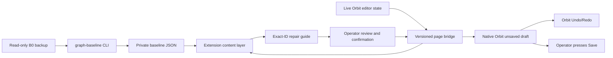

# Orbit Site Map Assistant knowledge base and runbook

## Purpose and status

This document captures the reusable engineering knowledge learned while building and validating the
Orbit Site Map Assistant extension. It is intended for:

- an operator repeating a recording-based Site Map split;
- an engineer maintaining the extension after an Orbit update;
- an AI agent automating the workflow;
- a future Codex skill that needs explicit safety and verification gates.

The observations and native editor action names in this document were verified against Orbit 5.1.8.
They are empirical compatibility findings, not a vendor-published extension API. The current
extension version is 0.8.1.

The extension is a repair assistant, not an Orbit replacement. It never assigns recordings, calls a
server write endpoint, or presses **Save**. Orbit remains responsible for recording moves, native
graph edits, Undo/Redo, validation, and persistence.

## The product model that matters

### A recording move is not a copy

Within one Orbit instance, a recording session belongs to only one Site Map at a time. Moving a
recording therefore changes ownership:

1. remove the recording from the source Site Map;
2. add the same recording to the target Site Map;
3. repair the target and source maps as necessary.

This is why a source backup is a hard prerequisite. There is no period in which the same recording
can safely remain assigned to both maps as a native rollback copy.

### Recording membership is not the final edited graph

A recording contains raw GraphNav waypoints and edges, but an edited Orbit Site Map also contains
site-level state:

- active SiteEdge overrides;
- manual/user-request edges;
- loop closures and localization edges;
- archived-edge tombstones;
- public GraphNav edge annotations;
- private SiteEdge wrapper fields;
- map-level Areas and other editor resources.

Moving recordings reconstructs membership, not the complete final Site Map edit history. The repair
workflow must compare the result with the final edited source state rather than assume that every
recording edge will reappear with the same site-level behavior.

### Effective topology has three inputs

For this observed Orbit backup shape, the final active edge set is:

```text
effective edges =
    (raw recording edges ∪ active SiteEdges)
    − SiteEdge tombstones
```

This formula explains several otherwise confusing results:

- a raw odometry edge can exist in the recording but still be absent from the final Site Map because
  a tombstone archives it;
- a manually created edge can exist only as a SiteEdge and have no raw recording counterpart;
- an active SiteEdge can override the public annotations of a raw edge with the same endpoints;
- the backup does not reveal whether a tombstone came from a deliberate operator action or Orbit
  normalization, so every tombstone must be compared by exact endpoints.

The implementation refuses an ambiguous backup in which an active SiteEdge and a tombstone have the
same endpoint pair and revision order cannot be established.

## Core design decision: immutable B0 plus live Orbit

The workflow uses two states:

- **B0** — a backup made before recording assignment changes. It is immutable and authoritative
  for the original final graph, deletion tombstones, and public edge settings.
- **Live Orbit** — the currently open Source or Destination Site Map after native recording moves.

A post-move backup, sometimes called B1, is optional. It is useful for final auditing and private
wrapper comparison, but it is not required to generate the live repair guide.

This is materially safer than synthesizing a new map archive because:

- recording identity remains native to the Orbit instance;
- Orbit creates every edit through its own editor state and Save path;
- the extension can stop before persistence;
- one native Undo step can reverse a validated batch;
- the original backup remains untouched.

## Identity rules

### Use exact IDs, never names or coordinates

The stable join keys are:

- Site Map ID;
- recording session ID;
- waypoint ID;
- canonical unordered edge endpoint pair;
- stored edge direction when replaying settings.

Waypoint names and recording names are display labels. They can be duplicated or changed.
Coordinates are presentation data and can change with anchoring. Neither is a valid identity key.

An edge's topology identity is the unordered pair:

```text
canonical_edge_key(A, B) = min(A, B) + "|" + max(A, B)
```

Settings replay has one additional requirement: the live stored direction must match B0 exactly.
Many annotation fields are direction-sensitive, so endpoint equality alone is insufficient.

### The desired result is an induced subgraph

For the currently open Site Map, let `W` be the set of live waypoint IDs that also existed in B0.
The desired graph is the B0 effective induced subgraph:

```text
desired edges = { (u, v) in B0 effective edges | u in W and v in W }
```

Each B0 edge is classified as:

- **internal** — both endpoints are in the current map; compare or repair it;
- **boundary cut** — exactly one endpoint is present; report it but never recreate it;
- **outside** — neither endpoint is present; ignore it for this map.

This rule makes the same B0 baseline reusable on both sides of a recording split.

### Newer extra recordings are a separate scope

The live map can contain recordings added after B0. A waypoint absent from B0 is an **extra
waypoint**. The extension excludes:

- the extra waypoint itself;
- every edge incident to that waypoint;
- all CONNECT, DELETE, and UPDATE guidance for that incident edge.

This is intentional. B0 cannot state what the newer recording should contain, so interpreting those
edges as unexpected would generate false deletions. The panel reports the ignored waypoint and edge
counts so the exclusion is visible and auditable.

## Architecture



### Offline baseline builder

`spot-map-forge graph-baseline` reads the backup without modifying or fully extracting it. It
produces a private JSON inventory containing:

- Site Map ID and name;
- every waypoint ID;
- every effective edge;
- active edge provenance and raw-counterpart information;
- every SiteEdge tombstone;
- the complete supported public edge annotation profile;
- a deterministic settings fingerprint;
- crosswalk detection;
- counts and explicit limitations.

Example:

```bash
uv run spot-map-forge graph-baseline /path/to/B0.tar \
  --map '<source-map-name-or-id>' \
  --out workspace/source-map/graph-baseline.json
```

The input backup and generated baseline are private operational artifacts. Do not commit them.

### Content layer

`baseline.js` and `content.js` run as Manifest V3 content scripts. Their responsibilities are:

- validate and normalize the imported baseline;
- request a bounded live graph snapshot;
- derive CONNECT, DELETE, UPDATE, and boundary-cut records;
- render the panel, inspector, progress, and SVG overlays;
- store the normalized baseline and local completion state;
- require user confirmation before Archive or settings restoration;
- mark an operation complete only after the page bridge verifies the draft.

The content layer cannot directly use Orbit's page-owned Redux objects because extension content
scripts run in an isolated JavaScript world.

### Versioned page bridge

`page-bridge.js` runs in the page world. It finds the existing Orbit Redux store through the React
tree and exposes a narrow same-origin message protocol.

The bridge accepts only these commands:

- `inspect`
- `snapshot`
- `resolve`
- `focus`
- `connect`
- `archive`
- `archive_many`
- `update_settings_many`

Inputs are bounded and normalized. Requests must match the Site Map ID in the current URL and the
map loaded in Orbit state. Messages from another window, origin, or channel are ignored.

The bridge is deliberately an adapter for one verified Orbit version. It is not a stable API.

## Baseline and live data contracts

### Baseline shape

A simplified baseline has this shape:

```json
{
  "schema_version": 1,
  "kind": "orbit_graph_baseline_inventory",
  "site_map": {"id": "<exact-map-id>", "name": "<display-name>"},
  "waypoint_ids": ["<waypoint-id>"],
  "effective_edges": [
    {
      "from": "<stored-from-waypoint-id>",
      "to": "<stored-to-waypoint-id>",
      "edge_source": "user-request",
      "provenance": "site_only",
      "has_raw_counterpart": false,
      "settings": {},
      "settings_fingerprint": "<sha256>",
      "has_crosswalk": false
    }
  ],
  "tombstones": []
}
```

The extension validates:

- baseline kind and schema;
- nonempty exact IDs with bounded length;
- no duplicate waypoint IDs;
- no self-edges;
- no edge outside the B0 waypoint set;
- no duplicate canonical endpoint pair;
- no pair that is both effective and tombstoned;
- no unknown public setting field;
- bounded nesting, arrays, keys, strings, and total object nodes;
- no prototype-pollution keys.

### Live snapshot

The bridge exposes a reduced snapshot, not the entire Redux store:

- exact current map identity;
- waypoint ID, name, recording ID/name, and live anchored position;
- active edge endpoints, stored direction, source, archive/disabled state, and public settings;
- resolved waypoint/edge counts;
- unresolved and foreign-endpoint counts.

Comparison stops when:

- any waypoint or edge remains unresolved;
- an edge references a waypoint outside the current map;
- a canonical endpoint pair appears more than once;
- Orbit reports zero scoped edges while B0 expects an internal graph.

These are usually loading or compatibility failures, not repair instructions.

### Public edge settings allowlist

The restore path supports these observed public `Edge.annotations` fields:

- `areaCallbacks`
- `audioVisualSettings`
- `cost`
- `directionConstraint`
- `disableAlternateRouteFinding`
- `disableDirectedExploration`
- `flatGround`
- `groundClutterMode`
- `maxCorridorDistance`
- `mobilityParams`
- `overrideMobilityParams`
- `pathFollowingMode`
- `requireAlignment`
- `stairs`

The UI groups differences into crosswalk/Area, mobility, stairs, direction, path following, ground,
cost, alternate route, directed exploration, and audio/visual categories.

A crosswalk is detected when an `areaCallbacks` entry has
`serviceName == "spot-crosswalk"`. Restoring a crosswalk edge restores its complete B0 public
annotation profile, not only the callback. This avoids creating an internally inconsistent partial
profile.

## Native edit semantics

### Focus

**Focus in Orbit** dispatches:

```text
mapDisplay/updateNeedsZoomToWaypoints
```

It changes camera/selection presentation only. If the action is missing after an Orbit upgrade,
focus fails while IDs remain copyable.

### Connect

**Connect in Orbit**:

1. verifies the exact map and two waypoint IDs;
2. rejects an existing active edge;
3. dispatches `mapEditorInfoSlice/setSelectedWaypoints`;
4. waits for Orbit's own asynchronous edge validator;
5. rejects validation errors, warnings, modal requirements, selection changes, or timeouts;
6. dispatches `mapEditorFormSlice/addSiteEdge` with Orbit's own candidate;
7. re-reads the exact edge;
8. requires the edit-history index to increase by exactly one.

The extension does not construct a replacement edge candidate from backup bytes.

### Archive

**Archive in Orbit** and the batch Archive:

1. repeat Orbit's warning that archiving edges can alter recording orientation relative to the
   drawing;
2. validate every exact endpoint pair before dispatch;
3. activate native edge-selection mode;
4. select the canonical edge key or complete key set;
5. dispatch `mapEditorFormSlice/archiveSiteEdges`;
6. clear the native edge selection;
7. require an exact archived record under
   `mapEditor.form.data.edges.nonEntities`;
8. require one edit-history increment.

Batch Archive is all-or-nothing from the extension's point of view. A missing, duplicate,
foreign-map, disabled, or already archived edge stops the batch before Archive dispatch.

Archive preserves the raw recording edge. Orbit records the same SiteEdge tombstone produced by its
native UI.

### Restore edge settings

**Restore settings in Orbit**:

1. validates every endpoint and exact stored direction;
2. requires an active, nonarchived edge on the current map;
3. rejects a changed edge source;
4. compares current public settings with the observed settings captured when the guide was built;
5. rejects stale settings;
6. copies the complete live SiteEdge wrapper;
7. replaces only the allowlisted public `Edge.annotations` profile;
8. preserves the live `edgeSource`;
9. dispatches `mapEditorFormSlice/updateSiteEdges` once;
10. re-reads every exact edge and requires one edit-history increment.

The live edge ID, transform, snapshot ID, source, map ID, and private SiteEdge wrapper are retained.
The backup wrapper is never transplanted.

The maximum validated Archive or settings batch is 5,000 edges. This is a defensive protocol bound,
not a claim about Orbit's supported operational limit.

## What is and is not preserved

### Restorable through the current extension

- missing manual or expected topology edges, through native Connect;
- resurrected tombstoned or otherwise unexpected edges, through native Archive;
- complete public edge annotation profiles on existing edges;
- edge-scoped crosswalk callbacks;
- mobility parameters and override masks;
- stairs and direction behavior;
- path-following and alignment behavior;
- ground and clutter behavior;
- route-finding and directed-exploration flags;
- edge cost;
- audio/visual settings.

### Reported but intentionally not recreated

- B0 edges split by the recording boundary;
- B0 objects wholly outside the current map;
- newer waypoints absent from B0 and every incident edge;
- B0-deleted edges whose current endpoints or anchors are unavailable.

### Not preserved or synthesized by this workflow

- private SiteEdge wrapper equality;
- private SiteWaypoint wrapper/settings equality;
- waypoint or edge snapshot byte equality;
- map-level Area objects and geometry;
- recording assignment itself;
- recording ownership history;
- map layout/pin state outside the fields explicitly inspected;
- Site View imagery or inspection history;
- missions, schedules, run results, or anomalies;
- unsupported private callbacks or future annotation fields.

A B1 backup is the appropriate place to audit private wrappers and payload equality. Live endpoint
and public-settings equality is not proof of whole-record equality.

## Operator runbook

### Phase 0: preflight

1. Record the Orbit version.
2. Create and retain a complete B0 backup.
3. Identify the Source Site Map by exact ID as well as name.
4. Generate `graph-baseline.json`.
5. Inspect the baseline counts for obvious parse or map-selection errors.
6. Load the unpacked extension into the same Chrome profile opened by `chrome-tablet-proxy`.
7. Confirm the extension version and reload both the extension and Orbit page after code changes.
8. Confirm there are no unsaved Source Site Map changes before moving recordings.

Do not begin with only a screenshot, map name, or manually copied edge list. The B0 backup is the
rollback and the exact-ID source of truth.

### Phase 1: native recording move

1. Decide the partition in whole recordings.
2. Review cross-recording manually created edges and dependencies before moving anything.
3. Remove the selected recordings from the Source Site Map in Orbit.
4. Add those recordings to the Destination Site Map in Orbit.
5. Save each native assignment change deliberately.
6. Wait for the Destination Site Map to finish loading waypoints, edges, recordings, and anchors.

If Orbit asks whether to discard changes while navigating, remain on the page unless discarding was
explicitly intended.

### Phase 2: load and classify

1. Open the exact result Site Map.
2. Click **Load B0 baseline** and select the private baseline JSON.
3. Wait for the live comparison.
4. Record:
   - current B0 waypoint count;
   - ignored extra waypoint/edge count;
   - desired internal edge count;
   - Connect count;
   - Archive count;
   - edge-settings count;
   - crosswalk-settings count;
   - Site Map boundary count;
   - stored-direction blocks.
5. Visually inspect **Site Map boundary** and the archived-edge overview.

Do not interpret a Site Map boundary edge as data loss. It is the expected consequence of placing
its two endpoints in different Site Maps.

### Phase 3: restore topology

The preferred order is:

1. preview every edge pending Archive;
2. Archive the validated edges, preferably as one reviewed batch;
3. Save in Orbit;
4. connect validated missing internal edges;
5. Save in Orbit;
6. click **Refresh**.

A newly connected edge can require edge-settings restoration after Refresh because it did not
exist during the first settings comparison.

For a large Archive batch, visually inspect the compound red overlay before accepting the
confirmation. Never use a count alone as the review.

### Phase 4: restore edge settings

Use a staged high-volume rollout:

1. click **Restore pending crosswalk settings**;
2. verify that Orbit created one unsaved draft with the expected crosswalk count;
3. verify Undo is enabled, Redo is disabled, and Save is enabled;
4. visually review crosswalk behavior;
5. Save in Orbit;
6. click **Restore all pending edge settings**;
7. verify one unsaved draft with the remaining expected count;
8. review and Save;
9. click **Refresh**.

The extension's local “done” count proves that the draft was read back before the button
returned. It does not prove that the operator pressed Save. A final Refresh or post-save backup is
the persistence check.

### Phase 5: final verification

After all intended edits:

1. Refresh the live comparison.
2. Confirm CONNECT, DELETE, and UPDATE are zero except consciously deferred work.
3. Confirm the remaining cuts equal the reviewed recording boundary.
4. Confirm ignored extras match known newer recordings.
5. Reopen the map or make a B1 backup when persistence evidence is required.
6. Compare B0/B1 offline for a stronger audit.
7. Retain the operation log, counts, Orbit version, extension version, and B0/B1 hashes.

## AI-agent workflow contract

An automation agent should use explicit phases and stop conditions.

### Read-only phase

Allowed without a write confirmation:

- inspect the current URL and exact map ID;
- read map, recording, waypoint, and edge counts;
- load or refresh the local B0 comparison;
- display and export repair lists;
- focus or highlight exact IDs;
- show deletion overlays;
- report ignored extras and boundary cuts.

### Draft-creation phase

Before a native draft, the agent must report:

- operation type;
- exact item count;
- current map ID;
- crosswalk count when applicable;
- whether stored directions all match;
- whether every target passed stale-state validation;
- expected Undo-step count.

The agent may create the draft only when the user has authorized that operation or batch. It must
then verify:

- exact returned count;
- one edit-history increment;
- expected read-back state;
- Undo enabled;
- Save enabled;
- no unexpected dialog or map navigation.

### Persistence phase

The extension must never press Save. Save remains an operator action because it persists a
potentially large graph change to Orbit.

After the operator reports Save:

- refresh comparison before claiming persistence;
- distinguish locally completed actions from server-persisted state;
- never infer Save from a disabled extension button alone.

### Stop conditions

Stop and require review when any of these occurs:

- map ID mismatch;
- Orbit version changed and the adapter has not been requalified;
- zero live edges with nonzero expected internal edges;
- unresolved or foreign waypoint/edge references;
- duplicate canonical edge pairs;
- stale observed settings;
- stored direction mismatch;
- changed edge source;
- validation warning or modal on Connect;
- edit history changes by anything other than exactly one step;
- expected draft cannot be read back;
- extra waypoint/edge counts are not explained by known newer recordings;
- the operation count differs from the reviewed count.

## Empirical validation record

One anonymized production-scale validation used:

- B0: 4,733 waypoints, 3,845 effective edges, 1,923 tombstones, and 185 crosswalk edges;
- result map: 3,225 waypoints across 34 recordings;
- desired B0-induced subgraph: 2,642 edges;
- ignored newer scope: 18 waypoints and 16 incident edges;
- comparison: 8 CONNECT, 0 DELETE, 2,428 UPDATE, 112 crosswalk UPDATE, and 6 boundary cuts;
- direction-blocked settings updates: 0.

The settings restoration was deliberately staged:

1. 112 crosswalk-bearing profiles produced one native unsaved draft and one Undo step; the operator
   reviewed and saved it.
2. The remaining 2,316 profiles produced a second native unsaved draft and one Undo step; the
   operator reviewed and saved it.

The extension reported zero pending setting updates after the second batch. CONNECT and boundary-cut
records remained separate and were not silently folded into the settings operation.

This validates the batch-draft and read-back mechanism at that scale on Orbit 5.1.8. It does not
establish cross-version compatibility or private wrapper equivalence.

## Failure modes and lessons learned

### Orbit had not finished loading

Symptoms:

- zero or unexpectedly small edge count;
- unresolved waypoint/edge error;
- baseline comparison disappears or refuses to generate guidance.

Response:

- wait for Orbit's recording and graph lists to settle;
- do not generate repair actions from partial state;
- click **Refresh** only after counts stabilize.

### Extension was loaded in the wrong Chrome profile

The Orbit instance was reachable only through the Chrome window created by
`chrome-tablet-proxy`. Loading the unpacked extension into a normal personal Chrome profile does not
affect the tablet-proxy window.

Response:

- open `chrome://extensions` in the tablet-proxy Chrome window itself;
- enable Developer mode;
- load `extension/orbit-graph-repair`;
- reload both the extension and Orbit editor.

### Manifest match pattern was invalid

Manifest V3 match patterns are stricter than ordinary glob patterns. The verified resource pattern
is:

```json
"matches": ["https://*/*"]
```

The content script is separately limited to:

```json
"matches": ["https://*/control_room/maps/*/edit*"]
```

Keep a manifest test so an invalid pattern is caught before manual installation.

### Large baseline exceeded normal local-storage expectations

The normalized B0 settings inventory can be several megabytes. The extension needs
`unlimitedStorage` in addition to `storage`, but it does not need network or broad host permissions.

Storage failures must be displayed. Silently retaining an older baseline can generate a plausible
but wrong guide.

### One-by-one Archive did not scale

Archiving more than a thousand edges individually is operationally unreasonable and makes review
hard. The batch solution:

- renders all target edges first as a compound SVG overlay;
- validates every pair before dispatch;
- uses Orbit's native multi-selection;
- creates one draft and one Undo step.

The visualization uses two compound SVG paths rather than one DOM node per edge to keep a large map
responsive.

### “Done” is not “saved”

The extension's completion state is local. It means the requested draft was verified, not that the
server accepted a Save. This distinction must remain visible in UI text, agent prompts, and audit
logs.

### Settings should be staged separately from topology

Topology and settings are different operations:

- CONNECT/DELETE modify membership of the effective edge set;
- UPDATE replaces the public profile on an already active edge;
- a newly connected edge cannot have been included in the earlier UPDATE guide.

Refresh after topology changes before assuming settings reconciliation is complete.

### Crosswalk-only is a risk-reduction stage

The crosswalk button is not a different serialization path. It filters UPDATE actions whose profile
contains or previously contained a crosswalk callback, then restores each complete profile through
the same native action.

This makes crosswalk-only restoration a useful canary batch:

- smaller reviewed count;
- visible operational behavior;
- one Undo step;
- same stale-state and direction guards as the full batch.

### Internal UI actions are compatible only by evidence

The extension does not use Orbit REST or a public extension API. It uses observed native Redux
action types and state shapes. This improves semantic compatibility with Orbit's editor and Undo
history, but it is still an internal, version-sensitive integration.

After any Orbit upgrade:

1. run static tests;
2. use a disposable map;
3. verify inspector and snapshot read-only behavior;
4. create and Undo one Connect draft;
5. create and Undo one Archive draft;
6. create and Undo one settings draft;
7. verify exact history increments and read-back;
8. only then re-enable production batches.

Fail closed when an action or state shape changes.

## Security, privacy, and publication boundary

The extension manifest intentionally has:

- no `host_permissions`;
- no background service worker;
- no `tabs` permission;
- no scripting permission;
- only `storage` and `unlimitedStorage`;
- one content-script match for Orbit Site Map edit pages;
- one page bridge exposed to HTTPS pages, with a same-origin, exact-channel protocol.

The implementation contains no `fetch`, `XMLHttpRequest`, WebSocket, REST path, Save action, or
credential access.

The baseline and guide still contain private site names, IDs, recording membership, and coordinates.
Keep them outside Git and public bug reports. Source publication does not itself establish that a
vendor license or customer agreement permits use in every deployment; perform the appropriate
contract review and describe the project as an independent, version-specific UI assistant rather
than an official integration.

## Maintenance checklist

When changing baseline or restore behavior:

- update the allowlisted public fields in both baseline and bridge code;
- keep deterministic property ordering for stable comparison;
- update prototype-pollution and size guards;
- add a Node-backed bridge test for the new field or action;
- add a Python baseline extraction test;
- retain exact map, endpoint, source, stale-settings, direction, and history guards;
- verify the extension still contains no network or Save primitive;
- update this knowledge base, the extension README, compatibility notes, and changelog;
- test installation in the actual tablet-proxy Chrome profile;
- validate one disposable unsaved draft and Undo before a batch.

## Related documentation

- [Orbit Site Map Assistant extension](../extension/orbit-graph-repair/README.md)
- [Orbit editor extension research](orbit-editor-extension-research.md)
- [Orbit-native recording move workflow](orbit-native-recording-move.md)
- [Architecture and data guarantees](architecture.md)
- [Compatibility and support levels](compatibility.md)
- [Privacy guide](privacy.md)
